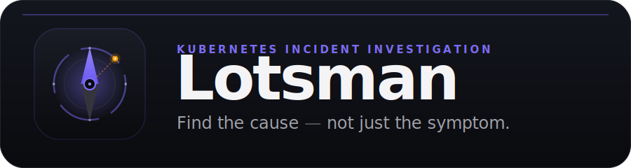
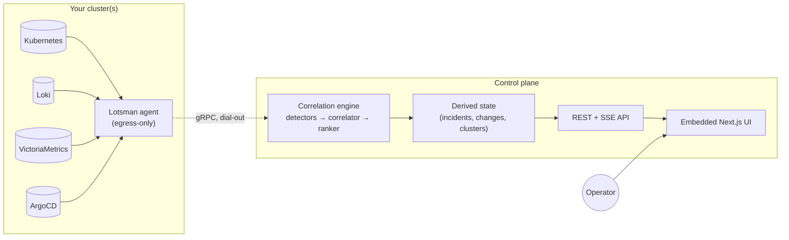
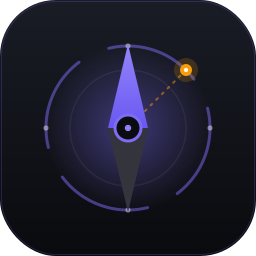

<p align="center">
  
</p>

<p align="center">
  <b>Self-hosted Kubernetes monitoring &amp; incident investigation.</b><br>
  Lotsman correlates logs, metrics, and deployment changes on one timeline and ranks the
  <i>probable cause</i> — it doesn't just draw dashboards.
</p>

<p align="center">
  <a href="https://github.com/kaminirio/lotsman/actions/workflows/ci.yml"></a>
  <a href="LICENSE"></a>
  
  
  
  <a href="CONTRIBUTING.md"></a>
</p>

---

> **lotsman** *(noun)* — a maritime **pilot**: the navigator who comes aboard to guide a
> ship safely through hazardous, unfamiliar waters. That's the job here — guiding you
> through an incident straight to what actually broke.

## Why Lotsman

When something breaks in Kubernetes, most tools hand you a wall of dashboards and logs and
leave the detective work to you. Lotsman flips that around. It ingests the three things
that explain almost every incident —

- **what's happening now** (metrics),
- **what the system is saying** (logs), and
- **what just changed** (deploys / rollouts / config),

— joins them on a single resource timeline, and **ranks the probable cause**. The ranker
is deliberately *change-first*: a deployment shortly before an incident is the top
hypothesis, because in practice it usually is.

> **The differentiator is the correlation engine — not the dashboards.** Everything else
> (adapters, storage, UI) exists to feed it neutral signals and present its verdict.

## Highlights

| | |
|---|---|
| 🧭 **Probable-cause ranking** | A change-first engine (detectors → correlator → ranker) that names *what changed* and why it's the likely cause — not just charts. |
| 🔌 **Source-agnostic by design** | Every backend sits behind a neutral interface. First-class adapters: **Kubernetes**, **Loki** (logs), **VictoriaMetrics/Prometheus** (metrics), **ArgoCD** (deployments). Swap or add backends without touching the engine. |
| 🛰️ **Agent + control plane** | An in-cluster agent dials **out** (egress-only) to a central control plane — no inbound ports to expose. Run it for many clusters, or in **direct mode** for one. |
| 🔎 **Query-through, not a data lake** | Logs and metrics are queried live; only derived state (incidents, change history, clusters) is persisted. Cheap to run, nothing to rot. |
| 🔐 **RBAC + SSO ready** | Config-driven role-based access scoped by cluster/namespace, GitHub OAuth sessions, and built-in log/secret redaction. |
| 🖥️ **One binary** | The Next.js UI (the "Warm Operator" design system) is embedded into the control-plane binary. Ship a single image. |

## Architecture



The agent dials out and proxies cluster reads; the control plane runs the engine, persists
incidents, and serves the API + UI. For a single reachable cluster, the control plane runs
in **direct mode** with no agent. Full design lives in
**[docs/ARCHITECTURE.md](docs/ARCHITECTURE.md)** and the decision records under
**[docs/adr/](docs/adr/)**.

## Quickstart

```sh
# Control plane in direct mode (no agent), in-memory store with seed data:
make run-server
# → REST API + UI on http://localhost:8080

curl localhost:8080/api/v1/incidents | jq        # seeded sample investigation
curl localhost:8080/api/v1/clusters  | jq

# UI dev server (talks to the API on :8080):
make ui-dev                                       # → http://localhost:3000
```

Want a **real, correlated incident** end to end? The local stack wires up Loki +
VictoriaMetrics + a demo workload and change feed:

```sh
make local-up           # control plane + Loki + VictoriaMetrics + demo data
make local-investigate  # POST an investigation and pretty-print the ranked cause
```

Build everything: `make build` · test: `make test` · images: `make docker`.

## Container images

Published to the GitHub Container Registry on every push to `main` (`:edge`) and on
release tags (`:1.2.3`, `:latest`). Three images — control plane, agent, and CLI — built
multi-arch for `linux/amd64` and `linux/arm64`:

```sh
docker pull ghcr.io/kaminirio/lotsman-server:latest   # control plane + embedded UI
docker pull ghcr.io/kaminirio/lotsman-agent:latest    # in-cluster agent
docker pull ghcr.io/kaminirio/lotsman-cli:latest      # operator CLI
```

To cut a release, push a
semver tag:

```sh
git tag v0.1.0 && git push origin v0.1.0
```

## Production install

The Quickstart above is for local dev. To deploy Lotsman to a real cluster, use the
Helm chart under [`deploy/helm/lotsman`](deploy/helm/lotsman):

```sh
helm install lotsman ./deploy/helm/lotsman \
  --namespace lotsman --create-namespace \
  --set secret.agentToken="$(openssl rand -hex 32)"
```

The chart deploys the control plane (REST/UI + agent gateway) and an optional
in-cluster agent, with production defaults (pinned tags, resource limits,
non-root/read-only securityContext, probes, RBAC). See the full
[**Production install guide**](docs/INSTALL.md) for direct vs. agent mode,
multi-cluster agents, external Postgres, SSO/OAuth, and upgrades.

## Project layout

| Path | What |
|------|------|
| `cmd/{server,agent,lotsman}` | control-plane, agent, and CLI entrypoints |
| `internal/sources` | backend-agnostic source interfaces + concrete adapters |
| `internal/engine` | correlation/investigation engine (detectors, correlator, ranker) |
| `internal/agentlink` | agent ↔ control-plane link (gRPC contract in `proto/`) |
| `internal/controlplane` | registry + wiring |
| `internal/api` | REST API + embedded UI |
| `internal/auth` · `internal/rbac` | sessions, GitHub OAuth, config-driven RBAC |
| `internal/store` | persistence (in-memory or Postgres, selected by config) |
| `ui/` | Next.js app (embedded into the control-plane binary) |

## Status

Lotsman is early and pre-1.0, but the core is built and tested (313 tests): the
correlation engine, the concrete adapters (Loki / VictoriaMetrics / ArgoCD /
Kubernetes), the gRPC agent transport, the Postgres store, the detector scheduler +
SSE bus, and GitHub OAuth + JWT + RBAC auth are all implemented and wired. What's
left is real product work — agentlink mTLS, the watch-event push path, metrics in
the correlation timeline, the CLI, a Helm chart, and richer ranker heuristics. See
`docs/ARCHITECTURE.md` §12 for the prioritized roadmap.

## Contributing

Contributions are welcome — see **[CONTRIBUTING.md](CONTRIBUTING.md)** for the dev setup,
the architecture rules PRs must respect, and the PR checklist. Found a security issue?
Please follow **[SECURITY.md](SECURITY.md)** (don't open a public issue).

## License

Licensed under the **[Apache License 2.0](LICENSE)**.

<p align="center"><br>
  <br>
  <sub><b>Lotsman</b> — find the cause, not just the symptom.</sub>
</p>
