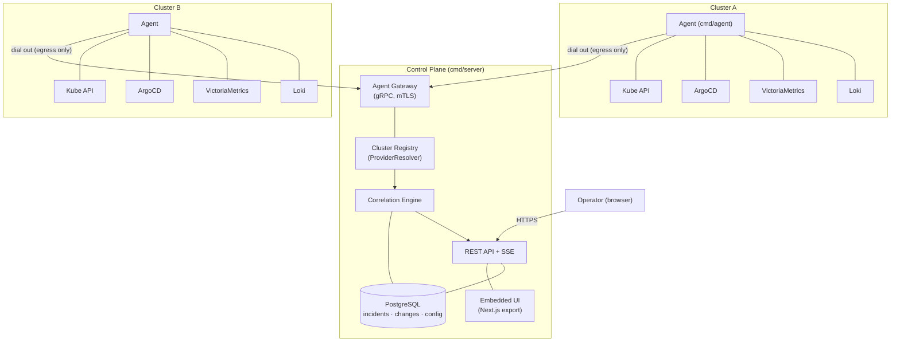
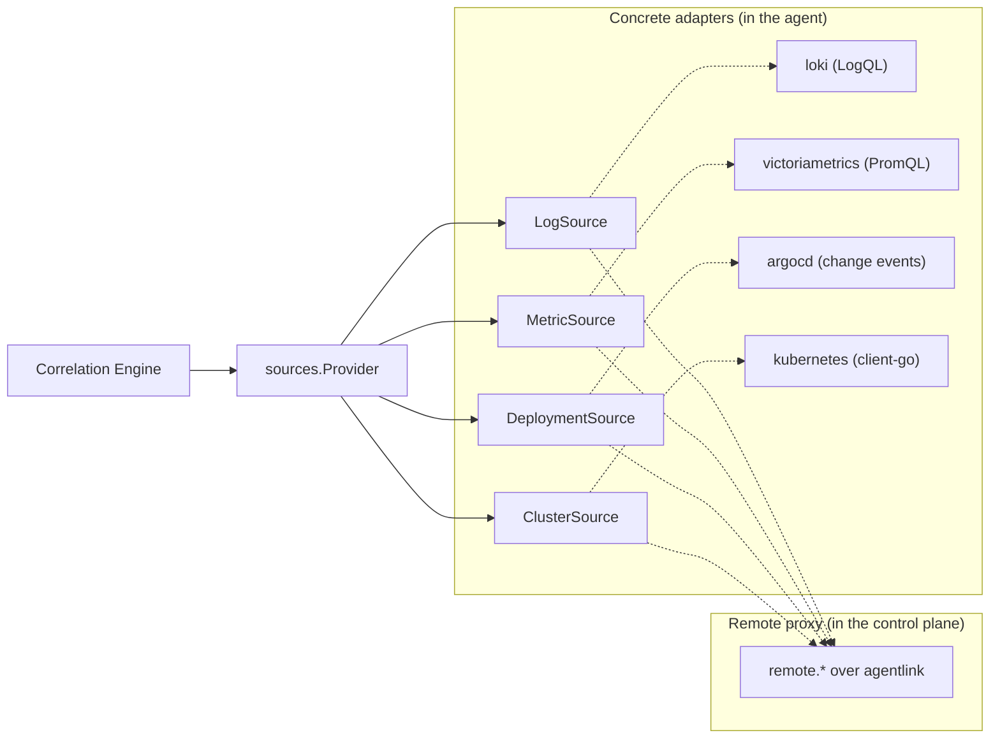
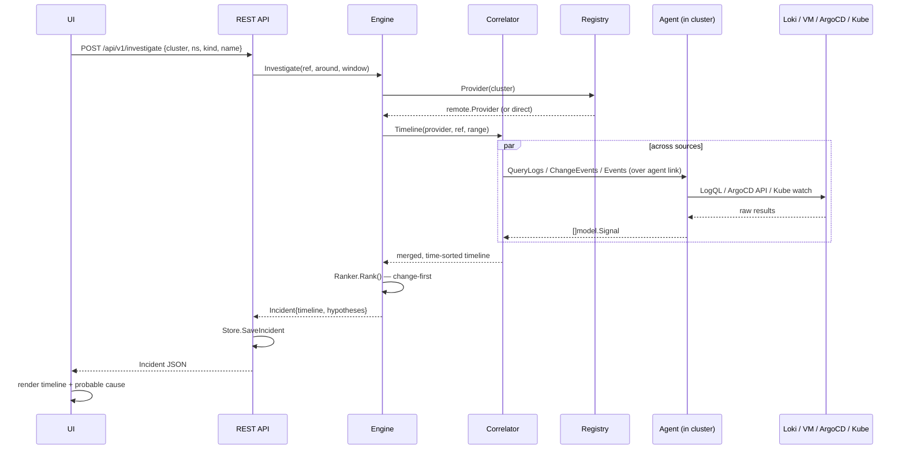

# Lotsman — Architecture

Lotsman is a self-hosted Kubernetes **monitoring and incident-investigation**
platform (a competitor to BetterStack and Komodor). Dashboards and alerts are
table stakes; Lotsman's reason to exist is **investigation** — correlating logs,
metrics, and deployment/change events on one resource timeline and ranking the
*probable cause* of an incident.

This document is the system design. Per-decision rationale lives in
[`adr/`](adr/). The structure, the interfaces, the engine, the concrete adapters,
the gRPC transport, the Postgres store, the detector scheduler, and auth are all
implemented and covered by tests; §12 tracks the work that genuinely remains.

---

## 1. Design principles

These four principles, agreed up front, constrain every decision below.

1. **Cloud- and environment-agnostic.** No backend (Loki, VictoriaMetrics, ArgoCD,
   Kubernetes) may be referenced outside its adapter. The engine and API speak only
   the neutral types in `internal/model`.
2. **Pluggable data sources.** Logs, metrics, deployments, and cluster state are
   four interchangeable interfaces. The first concrete stack is one implementation,
   never a hardcoded assumption.
3. **Investigation over display.** The defensible core is the correlation engine
   that answers *"what broke and what changed?"* — not panel rendering.
4. **Strong, consistent UI.** A polished operator UI is a first-class requirement;
   it uses the Warm Operator design system for a coherent, professional operator console.

---

## 2. Topology: agent + control plane

Lotsman uses an **in-cluster agent + central control plane** model (ADR-0001).
Each managed cluster runs a lightweight Go **agent** that **dials out** to the
control plane (egress-only — NAT/firewall friendly, no inbound exposure of the
cluster). The control plane runs the engine, persists state, serves the API + UI,
and accepts agent connections.

**Two modes, one engine.** For a single reachable cluster (the "first, solve my own
stack" case) the control plane can run in **direct mode** and talk to the backends
itself — no agent. This is the default for local dev. The engine cannot tell the
difference because both modes resolve to the same `sources.Provider` interface
(§4, ADR-0003).

---

## 3. Component responsibilities

| Component | Package | Responsibility |
|-----------|---------|----------------|
| **Agent** | `internal/agent` | Runs in a cluster. Builds concrete adapters, dials the control plane, serves proxied queries, pushes k8s/ArgoCD watch events. |
| **Agent link** | `internal/agentlink` | Transport-agnostic contract for the agent↔control-plane channel. Wire impl: gRPC bidi stream (`proto/lotsman.proto`); mTLS planned (§12). |
| **Cluster registry** | `internal/controlplane` | Maps a cluster → its `Provider` (direct or remote). Implements `engine.ProviderResolver`. |
| **Sources** | `internal/sources` | The four neutral interfaces + concrete adapters (`loki`, `victoriametrics`, `argocd`, `kubernetes`) + `remote` proxy. |
| **Engine** | `internal/engine` | Detectors → correlator → ranker. Builds incidents and ranks causes. |
| **Store** | `internal/store` | Persists incidents, change history, clusters, config. Postgres (pgx) when `DatabaseURL` is set; in-memory otherwise. |
| **API** | `internal/api` | REST for the UI + SSE for live updates + serves the embedded UI. |
| **UI** | `ui/` | Next.js operator app (incidents, timeline, clusters). |

---

## 4. The source-agnostic layer

This is the seam that makes Lotsman environment-agnostic. Four interfaces in
`internal/sources` describe *what* we read; adapters describe *how*.

- A `Provider` bundles the four sources for one cluster.
- In **agent mode**, the control plane's `Provider` is `sources/remote`, which
  marshals each call over the agent link; the agent runs the **concrete** adapters
  against in-cluster Loki/VM/ArgoCD/Kube.
- In **direct mode**, the control plane holds the concrete adapters itself.

Either way the engine calls the same methods — so correlation logic is written once
and runs unchanged across single-cluster dev and multi-cluster production.

**Why these four.** They map to the questions an investigation asks: *what is
running?* (Kubernetes), *what changed?* (ArgoCD), *how is it behaving?*
(VictoriaMetrics), *what is it saying?* (Loki). VictoriaMetrics is queried via the
**Prometheus HTTP API**, so plain Prometheus is a drop-in alternative.

---

## 5. The correlation / investigation engine

The engine is the product. It has three stages over the neutral signal stream.

- **Detectors** (`engine/detector`) — cheap, pluggable conditions that *open*
  candidate incidents: error-level Kubernetes events, a PromQL threshold breach
  (e.g. 5xx rate), a log-error burst. A scheduler runs these per cluster on a poll
  loop (`internal/controlplane/scheduler.go`).
- **Correlator** (`engine/correlator.go`) — given a resource + time window, gather
  signals from **all** sources and merge them into one time-sorted timeline. It is
  failure-tolerant: a Loki outage degrades the timeline but never blinds the rest.
- **Ranker** (`engine/ranker.go`) — turn the timeline into ranked **hypotheses**.
  The core heuristic is **change-first** (ADR-0008): a deploy/rollout shortly before
  the incident is the highest-precision root-cause signal — Komodor's "change
  intelligence", made the default.

Everything keys on a single identity, `model.ResourceRef`
(`cluster → namespace → workload → pod`), plus a timestamp. `ResourceFromLabels`
normalizes Prometheus/Loki label sets onto that identity so a metric series, a log
line, and a Kube event about the same Deployment line up.

### Investigation data flow

---

## 6. Data model (`internal/model`)

- **`ResourceRef`** — the universal identity; everything is keyed to it.
- **`Signal`** — one normalized observation: `Kind` (log/metric/change/k8s_event),
  `Resource`, `Timestamp`, `Severity`, `Source`, plus a kind-specific `Payload` and,
  for changes, a `ChangeRef`.
- **`Incident`** — `Resource`, `Timeline []Signal`, `Hypotheses []Hypothesis`,
  status/severity/timestamps.
- **`Hypothesis`** — a scored probable cause (`Confidence`, `Category`, `Evidence`,
  optional `Change`).

These types are deliberately free of any backend or transport import.

---

## 7. Agent ↔ control-plane link

Contract: [`proto/lotsman.proto`](../proto/lotsman.proto). One long-lived **gRPC
bidirectional stream** per agent. Identity is currently a shared enrollment token;
**mTLS** (ADR-0002) is the planned transport security and the gateway/dialer already
carry the seams for it (§12). The agent dials out and the stream multiplexes:

- **down** (control plane → agent): `Query` requests (proxied source calls);
- **up** (agent → control plane): `QueryResult` replies, pushed `Event`s from
  Kubernetes/ArgoCD watches, and heartbeats.

The Go side is modeled transport-free in `internal/agentlink` (`Link`, `Gateway`,
`Dialer`, `Request`/`Response`/`Event`) so the engine and registry never import
gRPC. `sources/remote` is the control-plane caller; `internal/agent`'s `handle`
is the agent-side executor — they are mirror images over the same request kinds.

UI↔control-plane is a **separate** channel: plain REST + SSE, not gRPC.

---

## 8. Storage (ADR-0004, ADR-0005)

Lotsman is **query-through, not a data lake.** It does **not** re-ingest logs or
metrics — those are queried live from Loki/VM through agents. It persists only its
own derived state, in **PostgreSQL** (pgx):

- incidents, timelines, and hypotheses;
- **change-event history** (ArgoCD syncs are ephemeral; the change backbone must be
  durable);
- clusters/agents, users/sessions, RBAC, configuration.

Both an in-memory `store.Memory` (with seed data) and a Postgres implementation
(pgx pool + embedded migrations) sit behind the same `store.Store` interface; the
Postgres path is auto-selected when `DatabaseURL` is set. The `Cluster` record
(env/region metadata) is designed for long-term schema stability.

---

## 9. API & UI

- **API** (`internal/api`) — Go 1.22+ `net/http` mux, lifecycle `New → Start →
  Shutdown`. Routes: `/healthz`, `/api/v1/version`,
  `/api/v1/incidents[/{id}]`, `/api/v1/investigate`, `/api/v1/clusters`,
  `/api/v1/stream` (SSE), `/auth/*`, and a catch-all serving the embedded UI.
- **UI** (`ui/`) — Next.js 16 + React 19 + TypeScript + Tailwind v4, **static
  export embedded into the Go binary** via `//go:embed` (single-binary deploy).
  Uses the "Warm Operator" design system, `apiFetch` client pattern, and
  auth context (ADR-0006).

---

## 10. Security, multi-tenancy, multi-cluster

- **Agent identity:** a shared enrollment `token` today; mTLS client certs are the
  planned end state (§12). Agents are egress-only; clusters expose nothing inbound.
- **User auth:** GitHub OAuth + JWT session cookies (HttpOnly), with a structured
  SSO config (ADR-0007). RBAC scopes visibility to clusters/namespaces.
- **Multi-cluster** is native: the registry keys everything by cluster, and
  `ResourceRef` carries the cluster at the root of identity.
- **Multi-tenancy** maps to RBAC over the (cluster, namespace) space; tenant
  boundaries are namespace-based.

---

## 11. Shared workspace (future)

The UI stack, auth patterns, ArgoCD client, and cluster model are good candidates for
extraction into a `securero/shared` workspace if a second operator tool on this stack
is introduced. The intended path:

1. **Now:** keep `module lotsman` independent; the UI design system and auth live
   directly in this repository.
2. **Later:** extract shared UI (`lib/styles`, auth context) and shared Go (ArgoCD
   client, cluster model, auth) into a `securero/shared` workspace. Lotsman's
   "what changed?" investigation timeline can then feed directly into deployment
   rollback tooling — investigation informing remediation.

---

## 12. Status & roadmap

Lotsman is pre-1.0, but the core is built, wired, and tested (313 tests across 25
packages).

**Working now:**

- **Concrete adapters** — `kubernetes` (client-go, all `ClusterSource` methods),
  `victoriametrics` (PromQL), `loki` (LogQL), `argocd` (change events over REST).
  Direct mode runs against a real cluster.
- **Postgres store** (pgx pool + embedded migrations) behind `store.Store`,
  auto-selected when `DatabaseURL` is set; in-memory store with seed data otherwise.
- **gRPC agentlink** — gateway + dialer from `proto/lotsman.proto`, enrollment-token
  auth, keepalive/reconnect, all 14 request kinds; multi-cluster agent mode and the
  `sources/remote` proxy work end to end.
- **Detector scheduler + SSE incident bus** — the scheduler polls per cluster and
  fans incidents out to the live event stream.
- **Auth** — GitHub OAuth + JWT sessions + config-driven RBAC, enforced on every
  handler.
- Compiles (`go build ./...`), serves the full incident timeline + ranked hypotheses
  over REST, and serves the embedded UI with SPA fallback.

**Remaining work (the real roadmap), roughly in priority order:**

1. **Agentlink mTLS.** The transport is plaintext today with a shared enrollment
   token for identity; the gateway/dialer have explicit `insecure` seams. Add mTLS /
   per-cluster identity (ADR-0002).
2. **Wire the watch-event push path end to end.** The push infrastructure exists
   (dialer event feed, gateway dispatch, `Link.Events()`) but the agent never starts
   a watch and nothing drains the stream, so detection is poll-only.
3. **Metrics in the correlation timeline.** The correlator gathers logs, deployments,
   and Kube events; `MetricSource` is not yet queried, so metric anomalies never reach
   the timeline or ranker.
4. **CLI** (`cmd/lotsman`) — currently a version-only stub; build out the real
   command surface.
5. **Helm chart / production manifests** — only dev-flavored local manifests exist
   today.
6. **Richer ranker heuristics** — the ranker is change-first but thin (deploy-before-
   incident + OOM/evicted); add log-burst / metric-anomaly hypotheses.

See [`adr/`](adr/) for the decisions behind all of the above.
